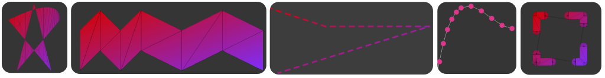
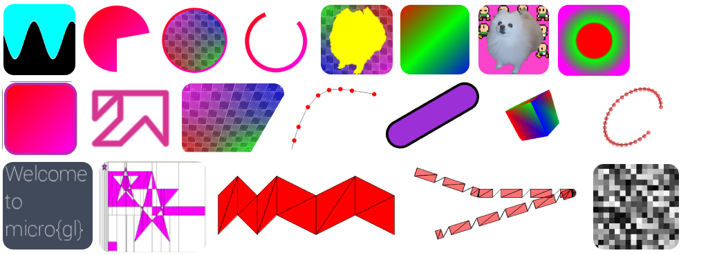

<div align='center'>

</div>

# nitro{gl}
[](https://github.com/micro-gl/nitro-gl/actions/workflows/compile_macos.yml)
[](https://github.com/micro-gl/nitro-gl/actions/workflows/compile_ubuntu.yml)
[](https://github.com/micro-gl/nitro-gl/actions/workflows/compile_windows.yml)

**Headers** only **`C++11`** **OpenGL** Vector Graphics library, that can run on all **OpenGL/ES** version.
 
Efficiently transforms a tree of shaders and samplers into a single shader at runtime.

Coming soon, Check out our website at [micro-gl.github.io/docs/nitrogl](https://micro-gl.github.io/docs/nitrogl)

<div align='center'>

</div>
<div align='center'>

</div>

## Example

```cpp
#define NITROGL_OPENGL_MAJOR_VERSION 4
#define NITROGL_OPENGL_MINOR_VERSION 1
//#define NITROGL_OPEN_GL_ES

#include "src/example.h"
#include "src/Resources.h"
#include <nitrogl/samplers/texture_sampler.h>
#include <nitrogl/samplers/color_sampler.h>
#include <nitrogl/canvas.h>

using namespace nitrogl;

//using path_t = path<std::vector>;
using path_t = nitrogl::path<dynamic_array>;

float t = 0.0f;

path_t path_star() {
  path_t path{};
  path.lineTo({150, 150})
  .quadraticCurveTo({450, 0}, {450, 150})
  .lineTo({200,450})
  .lineTo({300,50})
  .lineTo({400,450})
  .closePath();
  return path;
}

int main() {

  auto on_init = [](SDL_Window *, void *) {
    auto tex = gl_texture(100, 200);

    canvas canva(600, 600);

    auto tex_sampler_1 = texture_sampler(Resources::loadTexture("assets/images/test.png", true));
    auto tex_sampler_2 = texture_sampler(Resources::loadTexture("assets/images/test.png", false));
    auto tex_sampler_3 = texture_sampler(Resources::loadTexture("assets/images/uv_256.png", true), true);

    color_sampler sampler_color(1.0, 0.0, 0.0, 0.5f);

    // paths
    auto path = path_star();
    using il = std::initializer_list<int>;

    auto render = [&]() {
      canva.clear(1.0, 1.0, 1.0, 1.0);
      canva.drawPathStroke(
        sampler_color,
        path,
        12.0f,
        microtess::stroke_cap::round,
        microtess::stroke_line_join::round,
        5, il{0}, 0,
        mat3f::identity(),
        mat3f::identity()
      );
    };

    example_run<true>(canva, render);
  };

  example_init(on_init);
}
```

## Installing `nitro{gl}`
`nitrogl` is a headers only library, which gives the following install possibilities:
1. Using `cmake` to invoke the `install` target, that will copy everything in your system via
```bash
$ mkdir cmake-build-release
$ cd cmake-build-release
$ cmake -DCMAKE_BUILD_TYPE=Release ..
$ cmake --install .
```
2. Copying the `include/nitrogl` to anywhere you want.

## Consuming `nitro{gl}`
Following options are available:
1. copy the project to a sub folder of your project. inside your **`CMakeLists.txt`** add
```cmake
add_subdirectory(/path/to/nitrogl)
target_link_libraries(your_app nitrogl)
```
2. If you installed **`nitro{gl}`** with option 1 (see above) at your system, you can instead
```cmake
find_package(nitrogl CONFIG REQUIRED)
target_link_libraries(your_app nitrogl::nitrogl)
```
3. If you have not installed, you can add in your app's `CMakeLists.txt`
```cmake
target_include_directories(app path/to/nitrogl/folder/include/)
```
4. If you manually copied the `include/nitrogl` to the default system include path,  
you can use `cmake/Findnitrogl.cmake` to automatically create the cmake targets
```cmake
list(APPEND CMAKE_MODULE_PATH ${PROJECT_SOURCE_DIR}/path/to/Findnitrogl/folder)
find_package(nitrogl REQUIRED)
target_link_libraries(your_app nitrogl::nitrogl)
```
5. Just copy the `include/nitrogl` into a sub folder of your project and include the header  
files you need with relative path in your source files.

## Running Examples
First make sure you have 
 - [SDL2](https://www.libsdl.org/) installed at your system.  
 - [GLEW](https://glew.sourceforge.net/) installed at your system.  
 - [cmake](https://cmake.org/download/) installed at your system.

There are two ways:
1. Use your favourite IDE to load the root `CMakeLists.txt` file, and then it   
   will pick up all of the targets, including the examples
2. Using the command line:
```bash
$ mkdir cmake-build-release
$ cd cmake-build-release
$ cmake -DCMAKE_BUILD_TYPE=Release ..
$ cmake --build . --target <example_name>
$ ../examples/bin/example_name
```

```text
Author: Tomer Shalev, tomer.shalev@gmail.com, all rights reserved (2022)
```
